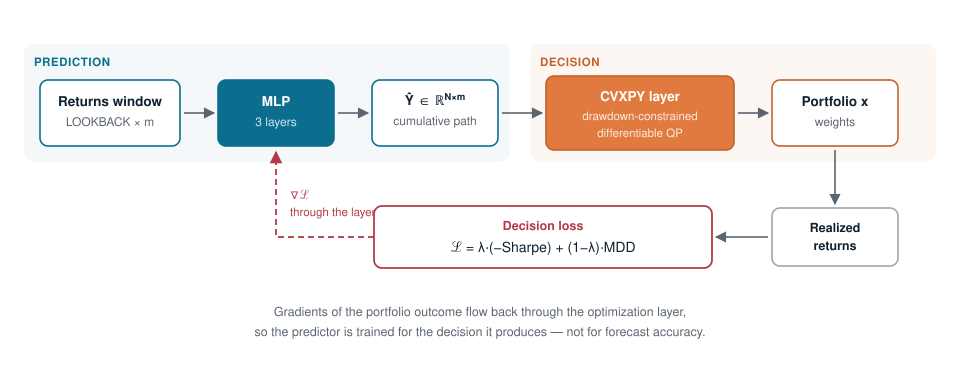

# cvxpy-portfolio-lab

Reproducible implementations of **Decision-Focused Learning (DFL)** portfolio optimization research, built on CVXPY and [cvxpylayers](https://github.com/cvxgrp/cvxpylayers).

The current focus is **DFL-MDD** — training a return-prediction model *through* a drawdown-constrained optimization layer, so that the predictor is optimized for the portfolio decision it produces rather than for forecast accuracy.

---

## Reference Papers

| Title | Authors | Venue | Year | Link | Code |
|-------|---------|-------|------|------|------|
| Portfolio Optimization with Drawdown Constraints | Chekhlov, Uryasev, Zabarankin | Supply Chain and Finance | 2003 | [DOI](https://www.worldscientific.com/doi/abs/10.1142/5440#page=222) | [DFL-MDD](DFL-MDD) |
| Integrating prediction in mean-variance portfolio optimization | Butler & Kwon | Quantitative Finance | 2023 | [arXiv](https://arxiv.org/abs/2102.09287) | *(planned)* |

---

## DFL-MDD

### Motivation

The conventional **Predict-Then-Optimize (PTO)** pipeline trains a forecaster under MSE and feeds its point estimates into an optimizer. The two stages never talk to each other: a forecast error that barely moves MSE can still swing the resulting portfolio badly, and vice versa.

DFL closes the loop. The optimization problem is embedded as a differentiable layer, so gradients of a *decision* loss flow back into the predictor.

### Architecture

<p align="center">
  
</p>

The predictor is a 3-layer MLP (`Linear → ReLU → Linear → ReLU → Linear`) mapping a flattened lookback window to an `N × m` cumulative-return path.

### Optimization layer

Given the predicted path `Ŷ = [ŷ₁, …, ŷ_N]`, solve

$$
\begin{aligned}
\max_{x, u} \quad
  & \hat{y}_N^\top x - \frac{\delta}{2} \lVert L^\top x \rVert^2 \\
\text{s.t.} \quad
  & u_0 = 0 \\
  & u_k - \hat{y}_k^\top x \le n_1 C, \quad k = 1, \dots, N \\
  & u_k \ge \hat{y}_k^\top x, \quad k = 1, \dots, N \\
  & u_k \ge u_{k-1}, \quad k = 1, \dots, N \\
  & x_{\min} \le x_i \le x_{\max}, \quad i = 1, \dots, m \\
  & \sum_{i=1}^{m} x_i = 1
\end{aligned}
$$

`u_k` tracks the running maximum of the cumulative return path, so `u_k − ŷ_kᵀx ≤ n₁C` caps the drawdown at any point within the horizon. `Σ = LLᵀ` is the Cholesky factor of the sample covariance, kept as a parameter so the problem stays DPP-compliant.

### Models compared

| Model | Prediction | Drawdown constraints | Note |
|-------|-----------|----------------------|------|
| **DFL-MDD** | decision loss | ✅ | proposed |
| **DFL-MVO** | decision loss | ❌ | ablation — isolates the contribution of the constraints |
| **PTO-MDD** | MSE | ✅ | ablation — isolates the contribution of the decision loss |
| **PTO-MVO** | MSE | ❌ | conventional two-stage baseline |
| EW / GMV / hist-MVO | — | — | benchmarks |

Comparing DFL-MDD against DFL-MVO and PTO-MDD separates the two moving parts: **the loss** and **the constraints**.

---

## Experimental design

| Axis | Values |
|------|--------|
| Universe | Fama-French **10** / **30** Industry Portfolios, daily, 2000–2025 |
| Validation | 8-fold walk-forward, test years 2018–2025, 5-year validation |
| Horizon `H` | 126 (6M), 252 (1Y) |
| Lookback `LB` | 252, 504, 1260 |
| Rebalancing | every 21 trading days |
| Drawdown limit `n₁` | 0.1, 0.2, 0.3, 0.4 |
| Loss weight `λ` | 0.3, 0.5, 0.7, 1.0 |
| Risk aversion `δ` | 20 (base); 20 → 10,000 sweep |
| Weight cap `x_max` | 1.0, 0.6, 0.3, 0.2 |
| Transaction cost | 0, 5, 10, 20, 40 bps |
| Solver | CLARABEL |

**Infeasibility handling (carry-forward).** A tight `n₁` can make the LP infeasible in a given window. Rather than dropping the window, the previous weights are held (no trade); if the very first window is infeasible, equal weights are used. This keeps every model on an identical, gap-free rebalancing calendar so paired statistical tests are valid.

**Evaluation.** Per-window maximum drawdown is compared with one-sided paired t-tests (Wilcoxon signed-rank reported alongside) at α = 0.10 / 0.05 / 0.01, over rebalancing dates common to all models.

---

## Repository layout

```
DFL-MDD/
├── dfl_mdd.py / dfl_mvo.py        model, optimization layer, training, backtest
├── pto_mdd.py / pto_mvo.py        MSE-trained baselines
├── benchmarks.py                  EW, GMV, hist-MVO (weight cap aware)
├── carryforward.py                infeasibility fallback
├── performance.py                 metrics, transaction costs, equity curves
├── plot_*.py, save_weights.py     figures and weight export
│
├── run_dfl_mdd.py / run_dfl_mvo.py    single-config training driver (CLI)
├── launch_dfl_*.py                    worker-pool launcher (shards by λ, LB, n₁)
├── merge_ckpt.py                      merge sharded checkpoints
├── run_xmax_sweep.py                  weight-cap sweep driver
│
├── 10_inds.ipynb / 30_inds.ipynb      main analysis
├── 10_inds_wcap.ipynb                 weight-cap analysis
│
├── checkpoint/   results/   plots/    outputs
└── sensitivity_results/               packaged sensitivity analysis (see its README)
```

### Running

Training is sharded across processes — one config per core, with intra-process threading pinned to 1 (`torch.set_num_threads(1)`, `OMP_NUM_THREADS=1`) so the pool scales linearly.

```bash
# single config
python run_dfl_mdd.py --lam 0.5 --n1 0.2 --lookback 252 --horizon 126

# parallel sweep, then merge the shards
python launch_dfl_mdd.py --workers 16 --lam 0.3 0.5 0.7 1.0
python merge_ckpt.py
```

Checkpoints are named

```
dfl_mdd_{N}_inds_h{H}[_xm{cap}][_LB{lb}][_n1{n1}]_d{δ}_l{λ}_{solver}.pkl
```

with bracketed tags present only for non-default values, so a run can be resumed or extended without recomputing what already exists.

---

## Findings

**Drawdown constraints help, and more so at longer horizons.** Against DFL-MVO, DFL-MDD's per-window drawdown advantage is significant in 3/8 configurations at H=126 but 6/8 at H=252 (30 industries, α=0.05).

**The advantage is partly a diversification effect.** Imposing `x_max = 0.3` drops DFL-MVO's concentration from HHI ≈ 1.00 to 0.28 and shrinks DFL-MDD's edge to 4/8 — indicating that some of the drawdown benefit came from the constraints forcing diversification rather than from drawdown control as such.

**The weight cap is a turnover tool.** `x_max = 0.3` cuts turnover 0.600 → 0.359 (−40%) and HHI 0.472 → 0.265, while return, Sharpe and MDD stay within config-to-config noise. At 40 bps the annual return give-up falls 3.04%p → 1.86%p and Calmar rises 0.144 → 0.231.

**`δ` is not a usable risk dial.** Portfolios do not move until δ ≈ 2,000–5,000. The objective mixes an `N`-day cumulative return term with a *daily* covariance, so δ must absorb a factor of roughly `N`; prediction-scale inflation accounts for the rest. Derivation and numbers: [`sensitivity_results/docs/delta_analysis.md`](DFL-MDD/sensitivity_results/docs/delta_analysis.md).

**Transaction costs are the binding constraint.** DFL-MDD turns over roughly twice as much as hist-MVO. The drawdown advantage survives to 40 bps, but the Calmar advantage over benchmarks does not.

Full tables, figures and statistical tests: [`DFL-MDD/sensitivity_results/`](DFL-MDD/sensitivity_results).

---

## Requirements

Python 3.11 · PyTorch · CVXPY · cvxpylayers · CLARABEL · NumPy · pandas · matplotlib · seaborn
