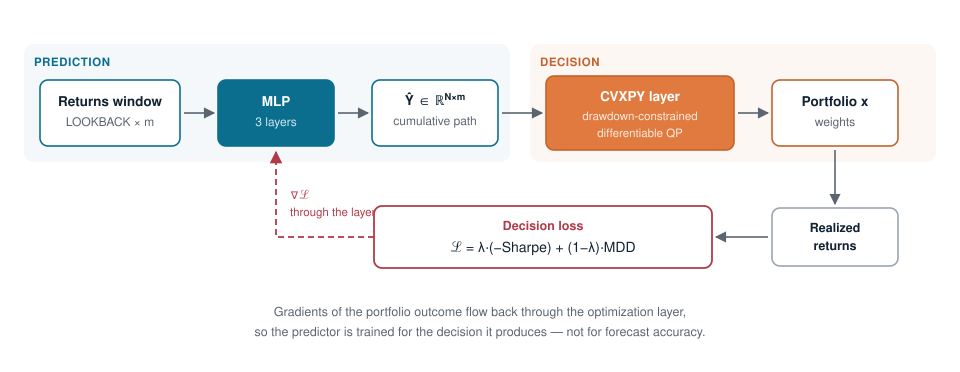

# cvxpy-portfolio-lab

Reproducible implementations of **Decision-Focused Learning (DFL)** portfolio optimization research, built on CVXPY and [cvxpylayers](https://github.com/cvxgrp/cvxpylayers).

The current focus is **DFL-MDD** — training a return-prediction model *through* a drawdown-constrained optimization layer, so that the predictor is optimized for the portfolio decision it produces rather than for forecast accuracy.

---

## DFL-MDD

### Motivation

The conventional **Predict-Then-Optimize (PTO)** pipeline trains a forecaster under MSE and feeds its point estimates into an optimizer. The two stages never talk to each other: a forecast error that barely moves MSE can still swing the resulting portfolio badly, and vice versa.

DFL closes the loop. The optimization problem is embedded as a differentiable layer, so gradients of a *decision* loss flow back into the predictor.

### Architecture

<p align="center">
  
</p>

The predictor is a 3-layer MLP (`Linear → ReLU → Linear → ReLU → Linear`) mapping a flattened lookback window to an `N × m` cumulative-return path.

### Optimization layer

Given the predicted path `Ŷ = [ŷ₁, …, ŷ_N]`, solve

$$
\begin{aligned}
\max_{x, u} \quad
  & \hat{y}_N^\top x - \frac{\delta}{2} \lVert L^\top x \rVert^2 \\
\text{s.t.} \quad
  & u_0 = 0 \\
  & u_k - \hat{y}_k^\top x \le \bar{d} C, \quad k = 1, \dots, N \\
  & u_k \ge \hat{y}_k^\top x, \quad k = 1, \dots, N \\
  & u_k \ge u_{k-1}, \quad k = 1, \dots, N \\
  & x_{\min} \le x_i \le x_{\max}, \quad i = 1, \dots, m \\
  & \sum_{i=1}^{m} x_i = 1
\end{aligned}
$$

`u_k` tracks the running maximum of the cumulative return path, so `u_k − ŷ_kᵀx ≤ d̄C` caps the drawdown at any point within the horizon. `Σ = LLᵀ` is the Cholesky factor of the sample covariance, kept as a parameter so the problem stays DPP-compliant.

---

## Experimental design

| Axis | Values |
|------|--------|
| Universe | Fama-French **10** / **30** Industry Portfolios, daily, 2000–2025 |
| Validation | 8-fold walk-forward, test years 2018–2025, 5-year validation |
| Horizon `H` | 126 (6M), 252 (1Y) |
| Lookback `LB` | 252, 504, 1260 |
| Rebalancing | every 21 trading days |
| Drawdown limit `d̄` | 0.1, 0.2, 0.3, 0.4 |
| Loss weight `λ` | 0.3, 0.5, 0.7, 1.0 |
| Weight cap `x_max` | 1.0, 0.6, 0.3, 0.2 |
| Solver | CLARABEL |

---

## Repository layout

```
DFL-MDD/
├── dfl_mdd.py / dfl_mvo.py        model, optimization layer, training, backtest
├── pto_mdd.py / pto_mvo.py        MSE-trained baselines
├── benchmarks.py                  EW, GMV, hist-MVO (weight cap aware)
├── carryforward.py                infeasibility fallback
├── performance.py                 metrics and equity curves
├── plot_*.py, save_weights.py     figures and weight export
│
├── run_dfl_mdd.py / run_dfl_mvo.py    single-config training driver (CLI)
├── run_pto_mdd.py                     PTO-MDD driver, used for lookbacks outside the default grid
├── launch_dfl_*.py                    worker-pool launcher (shards by λ, LB, d̄)
├── merge_ckpt.py                      merge sharded checkpoints
├── run_xmax_sweep.py                  weight-cap sweep driver
│
├── make_overall_plots.py              overall-comparison figures, verified against the tables
├── analyze_mdd_ttest_by_n1.py         per-window drawdown tests, one per drawdown limit
├── analyze_n1_monotonicity.py         does realized risk order in the limit?
├── plot_n1_monotonicity.py            figure for the above
│
├── 10_inds.ipynb / 30_inds.ipynb      main analysis
├── 10_inds_wcap.ipynb                 weight-cap analysis
└── check_dd_duration.ipynb            drawdown-duration evidence for the horizon choice
```

Everything a run produces — `checkpoint/`, `logs/`, `weights/`, `results/`, `plots/` and `sensitivity_results/` — stays out of the repository.

### Input data

The return series are not redistributed here. Download the daily **10 Industry Portfolios** and **30 Industry Portfolios** from the [Kenneth R. French Data Library](https://mba.tuck.dartmouth.edu/pages/faculty/ken.french/data_library.html), take the *Average Value Weighted Returns — Daily* block from each file, and save it as

```
DFL-MDD/csv/10_industry.csv
DFL-MDD/csv/30_industry.csv
```

with a `Date` column in `YYYY-MM-DD` and one column per industry, in percent. The loaders divide by 100, drop duplicate dates and sort by date; values of `-99.99` and `-999` mark missing data and do not occur over 2000–2025.

### Running

Training is sharded across processes — one config per core, with intra-process threading pinned to 1 (`torch.set_num_threads(1)`, `OMP_NUM_THREADS=1`) so the pool scales linearly.

```bash
# single config
python run_dfl_mdd.py --lam 0.5 --n1 0.2 --lb 252 --horizon 126

# parallel sweep, then merge the shards
python launch_dfl_mdd.py --jobs 16 --lam 0.3 0.5 0.7 1.0
python merge_ckpt.py

# the ablations and baselines
python run_dfl_mvo.py --data 10 --lam 0.5 --horizon 126
python run_pto_mdd.py --data 10 --lb 1260 --horizon 126
python run_xmax_sweep.py --data 10 --xmax 0.6 0.3 0.2
```

The CLI flag and the checkpoint tag are both spelled `n1`; `d̄` is the notation used in the paper for the same quantity. Checkpoints are named

```
dfl_mdd_{N}_inds_h{H}[_xm{cap}][_LB{lb}][_n1{d̄}]_d{δ}_l{λ}_{solver}.pkl
```

with bracketed tags present only for non-default values, so a run can be resumed or extended without recomputing what already exists.

---

## Requirements

Python 3.11 · PyTorch · CVXPY · cvxpylayers · CLARABEL · NumPy · pandas · matplotlib · seaborn
